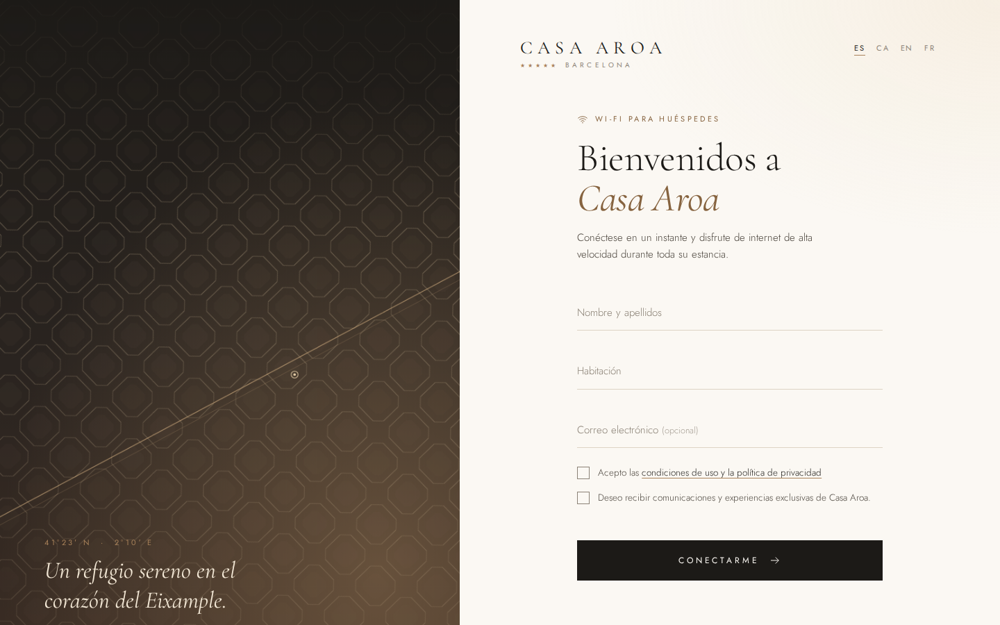
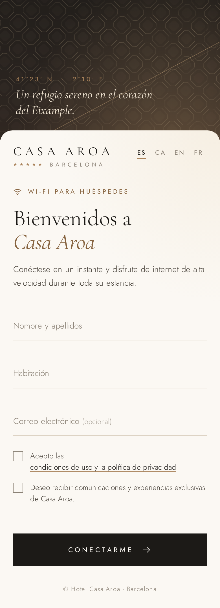
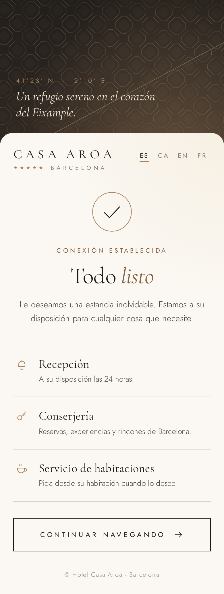

# Hotel Casa Aroa · Portal WiFi para UniFi (UDM Pro)

Portal cautivo premium para la red de invitados del hotel: multilingüe (ES · CA · EN · FR), pensado para móvil primero y con un guiño a Barcelona (el trazado de manzanas achaflanadas del Eixample de Cerdà, atravesado por la Diagonal).

| Escritorio | Móvil | Conectado |
|---|---|---|
|  |  |  |

---

## ¿Se puede personalizar el portal del UDM Pro?

Sí. Hay tres niveles:

| Opción | Personalización | Resistente a actualizaciones | Dificultad |
|---|---|---|---|
| **A. Editor del portal de UniFi** (Hotspot Manager → Portal) | Logo, fondo, colores, textos, condiciones | ✅ | Baja |
| **B. Portal externo** (este proyecto, carpeta `server/`) ⭐ | **Total** | ✅ | Media |
| **C. Sustituir los ficheros del portal por SSH** | Total | ❌ se pierde con cada actualización | Media, frágil |

**Recomendación para un 5 estrellas: opción B.** Por SSH se puede tocar el portal interno (opción C), pero:
- Cada actualización de UniFi OS o de la app Network **sobrescribe** los ficheros.
- Las versiones recientes de UniFi Network han rehecho el portal de invitados y no hay garantía de que sigan leyendo una carpeta personalizada.
- Ubiquiti no lo soporta, así que un fallo tras una actualización deja a los huéspedes sin WiFi.

Con el **portal externo**, UniFi solo redirige al huésped a tu servidor, y tu servidor autoriza el dispositivo mediante la API del UDM. El diseño es 100 % tuyo y las actualizaciones del UDM no le afectan.

---

## Estructura

```
hotspot-casa-aroa/
├── portal/              ← la página (HTML/CSS/JS estáticos, sin dependencias)
│   ├── index.html
│   ├── styles.css
│   ├── app.js           ← lógica + textos en 4 idiomas
│   ├── config.js        ← ★ lo que se edita: modo, logo, foto, campos, servicios
│   ├── fonts/           ← Cormorant Garamond + Jost autoalojadas (OFL)
│   └── img/             ← pon aquí logo.svg y hero.jpg
└── server/              ← servidor de portal externo (Node.js 18+, sin dependencias)
    ├── server.js
    ├── unifi.js         ← cliente API UniFi (login UniFi OS + authorize-guest)
    ├── .env.example
    ├── Dockerfile / docker-compose.yml
    └── casa-aroa-portal.service   ← unidad systemd
```

Las fuentes van incluidas porque, antes de autenticarse, el huésped **no tiene internet** y Google Fonts no cargaría.

---

## Opción B · Portal externo (recomendado)

### 1. Dónde ejecutarlo
Cualquier equipo siempre encendido en la red del hotel: mini‑PC, Raspberry Pi, NAS con Docker o una VM. Dale una **IP fija** (p. ej. `192.168.1.10`) accesible desde la VLAN de invitados.

### 2. Usuario en el UDM
En UniFi OS → *Admins & Users* crea un **usuario local** (no una cuenta Ubiquiti/SSO) con acceso a la app Network y el rol más limitado que permita gestionar el hotspot (p. ej. *Hotspot Operator* / *Site Admin* según versión). Sin 2FA para este usuario.

### 3. Configurar y arrancar

**Con Docker**
```bash
cd hotspot-casa-aroa/server
cp .env.example .env && nano .env        # IP del UDM, usuario, contraseña…
mkdir -p data && sudo chown 1000:1000 data
docker compose up -d --build
```

**Con systemd (sin Docker)**
```bash
sudo useradd -r -s /usr/sbin/nologin portal
sudo mkdir -p /opt/casa-aroa-portal && sudo cp -r portal server /opt/casa-aroa-portal/
cd /opt/casa-aroa-portal/server && sudo cp .env.example .env && sudo nano .env
sudo mkdir -p data && sudo chown portal data
sudo cp casa-aroa-portal.service /etc/systemd/system/
sudo systemctl daemon-reload && sudo systemctl enable --now casa-aroa-portal
```

Prueba sin tocar UniFi: `npm run dev` y abre `http://localhost:8080/guest/s/default/?id=aa:bb:cc:dd:ee:ff`.

### 4. En UniFi Network
1. **Hotspot Manager / Portal de invitados** → activa el portal en la red WiFi de invitados.
2. Autenticación: **Portal externo** (*External Portal Server*) → IP del servidor (`192.168.1.10`).
3. Las páginas del propio portal no necesitan *Pre-Authorization Allowances* (todo se sirve local). Añade ahí solo los dominios que enlaces desde el portal antes de conectar.
4. Si tienes reglas de firewall / aislamiento en la VLAN de invitados, permite **TCP 80** hacia la IP del portal.
5. Recomendado: activa *HTTPS redirection* solo si tienes certificado; si no, déjalo desactivado (los móviles detectan el portal por HTTP igualmente).

### 5. Cómo funciona
```
Huésped se conecta ─► UniFi lo redirige a http://192.168.1.10/guest/s/default/?id=<MAC>&ap=…&url=…
                     ─► rellena nombre + habitación y acepta condiciones
                     ─► POST /api/authorize ─► server.js hace login en el UDM
                        y envía  cmd: authorize-guest  (MAC, minutos, límites)
                     ─► pantalla "Todo listo" con los servicios del hotel
```

Variables útiles en `.env`: `GUEST_MINUTES` (duración), `GUEST_DOWN_KBPS` / `GUEST_UP_KBPS` / `GUEST_MB_LIMIT` (límites), `ACCESS_CODE` (código diario de recepción; si se define, el portal muestra el campo automáticamente).

---

## Opción C · Ficheros dentro del UDM Pro por SSH

Úsala solo si aceptas re‑copiar los ficheros tras cada actualización.

1. Activa SSH: UniFi OS → *Control Plane / Console Settings* → *SSH*.
2. En `portal/config.js` pon `mode: "unifi"`.
3. Localiza la carpeta del portal (la ruta cambia según versión):
   ```bash
   ssh root@192.168.1.1
   find / -type d -name "app-unifi-hotspot-portal" 2>/dev/null
   # suele ser /data/unifi/data/sites/default/app-unifi-hotspot-portal
   #        o   /usr/lib/unifi/data/sites/default/app-unifi-hotspot-portal
   ```
4. Copia de seguridad y subida:
   ```bash
   P=/data/unifi/data/sites/default/app-unifi-hotspot-portal   # la ruta encontrada
   ssh root@192.168.1.1 "cp -a $P ${P}.bak"
   scp -r portal/* root@192.168.1.1:$P/
   ```
5. En la app Network activa el portal con autenticación *Sin contraseña / Aceptar condiciones* (o *Contraseña* si usas el código de acceso).
6. **Verifica el endpoint de login**: los nombres de campo que espera UniFi pueden variar entre versiones. Abre una vez el portal original con DevTools → *Network*, mira la petición `login` y ajusta la función `unifiLogin` de `config.js` si difiere.

Si tras una actualización ya no se usa la carpeta personalizada, pasa a la opción B: el mismo `portal/` sirve para ambas.

---

## Personalizar

Todo en `portal/config.js`:
- `hotel.logo` → `"img/logo.svg"` para usar el logotipo oficial en lugar del tipográfico.
- `heroImage` → `"img/hero.jpg"` (≈1600 px, < 300 KB) para una foto del hotel en vez de la ilustración.
- `form` → activar/desactivar habitación, email o código de acceso.
- `services` → tarjetas de la pantalla final (recepción, spa, restaurante…); con `href` se vuelven enlaces (añade esos dominios a *Pre-Authorization Allowances* o enlaza solo a webs públicas, ya accesibles tras conectar).
- `redirectUrl` → `""` pantalla del hotel · URL fija · `"original"` para volver a lo que pedía el huésped.
- Textos e idiomas: objeto `I18N` en `app.js`.
- Colores y tipografía: variables `:root` al inicio de `styles.css`.

## RGPD

- El servidor guarda cada alta en `server/data/guests.jsonl` (nombre, habitación, email opcional, consentimiento, MAC). Define un **plazo de conservación** y bórralo periódicamente (p. ej. `find data -name '*.jsonl' -mtime +30`), o desactiva el registro.
- El consentimiento de comunicaciones comerciales es separado y opcional, como exige la normativa.
- El texto de condiciones y privacidad (en `app.js`) es una **base genérica**: que lo revise el asesor legal del hotel y complete los datos del responsable (razón social, NIF, dirección, email de contacto).
